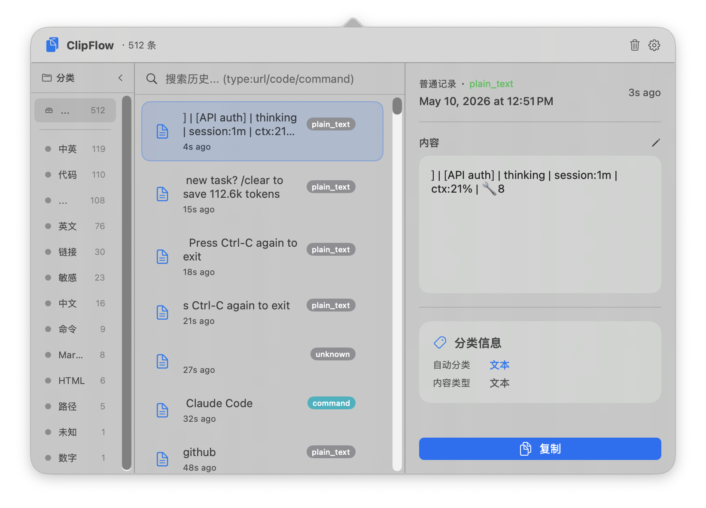

# ClipFlow

macOS 菜单栏剪贴板历史管理工具。

## 功能特性

- **剪贴板历史** — 自动记录 macOS 文本剪贴板内容，0.5 秒轮询
- **智能分类** — 内置分类：链接、邮件、代码、数字、中文、英文、中英混合、其他
- **搜索与筛选** — 全文搜索 + 分类侧边栏
- **收藏** — 标记重要记录，收藏不会被自动清理
- **自动清理** — 可配置 1~30 天保留期，到期自动删除非收藏记录
- **全局快捷键** — 自定义快捷键呼出面板，默认 ⌘⇧V
- **隐私优先** — 数据本地 SQLite 存储

## 系统要求

- macOS 13.0+
- Xcode 15.0+（构建需要）

## 构建

```bash
git clone https://github.com/likzq30-ship-it/clipflow.git
cd clipflow
xcodebuild -project ClipFlow.xcodeproj -scheme ClipFlow -configuration Release build
```

产物位于 Xcode DerivedData 目录，或打开 `ClipFlow.xcodeproj` 用 Xcode 直接 Cmd+B。

## 使用方法

- ClipFlow 运行后图标显示在菜单栏
- 点击图标或按快捷键 ⌘⇧V 呼出面板
- 点击任意记录可复制回剪贴板
- 搜索栏支持全文检索
- 左侧分类栏可按类型筛选
- 悬停显示收藏和删除按钮
- 右键菜单栏图标 → 设置 / 退出

## 隐私说明

- 所有剪贴板数据存储在本地 SQLite：`~/Library/Application Support/ClipFlow/clipflow.sqlite3`
- 数据完全本地，不上传任何内容

## 截图



## License

MIT License. 详见 [LICENSE](LICENSE).

## Authors

- [likzq](https://github.com/likzq30-ship-it)
- Claude Code
