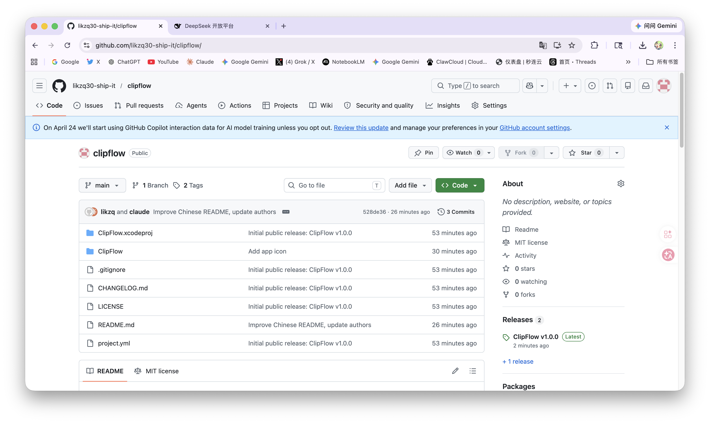
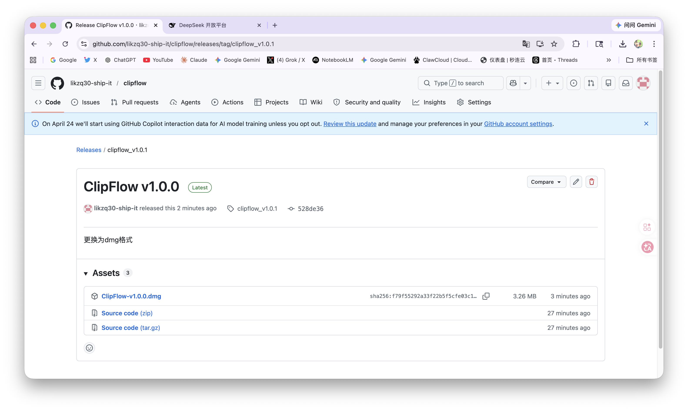
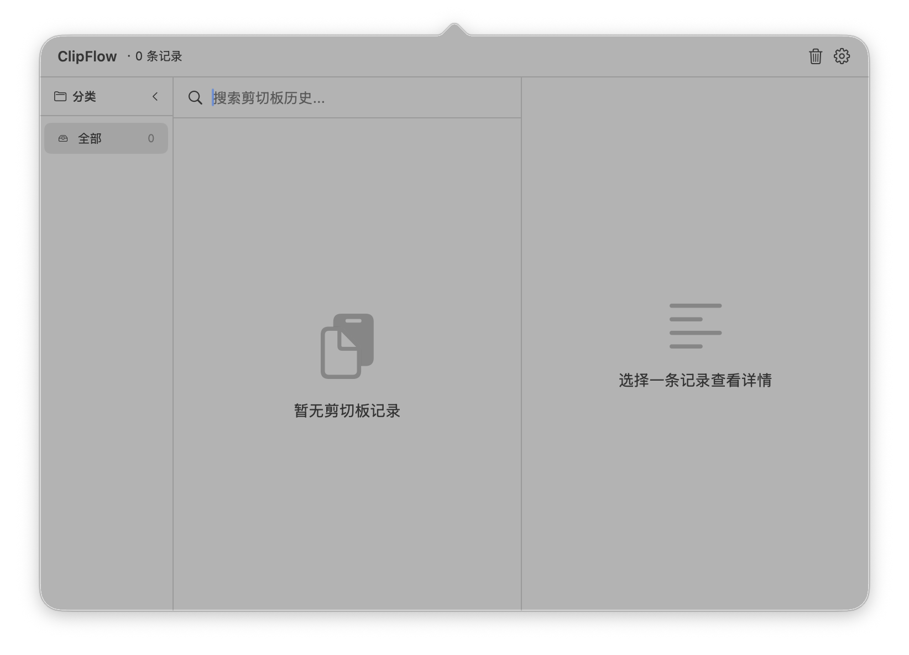

# ClipFlow

macOS 菜单栏剪贴板历史管理工具，支持本地 AI 智能汇总与分类。

## 功能特性

- **剪贴板历史** — 自动记录 macOS 文本剪贴板内容，0.5 秒轮询
- **智能分类** — 内置分类：链接、邮件、代码、数字、中文、英文、中英混合、其他
- **AI 汇总** — 一键调用本地 Ollama 对剪贴板内容生成一句话摘要
- **AI 自定义分类** — 自定义分类名称和匹配提示词，AI 自动归类
- **搜索与筛选** — 全文搜索 + 分类侧边栏
- **收藏** — 标记重要记录，收藏不会被自动清理
- **自动清理** — 可配置 1~30 天保留期，到期自动删除非收藏记录
- **全局快捷键** — 自定义快捷键呼出面板，默认 ⌘⇧V
- **隐私优先** — 数据本地 SQLite 存储，AI 功能依赖本地 Ollama

## 系统要求

- macOS 13.0+
- Xcode 15.0+（构建需要）
- [Ollama](https://ollama.com)（可选，AI 功能需要）

## 构建

```bash
git clone https://github.com/likzq30-ship-it/clipflow.git
cd clipflow
xcodebuild -project ClipFlow.xcodeproj -scheme ClipFlow -configuration Release build
```

产物位于 Xcode DerivedData 目录，或打开 `ClipFlow.xcodeproj` 用 Xcode 直接 Cmd+B。

## 使用方法

- ClipFlow 运行后图标显示在菜单栏
- 点击图标或按快捷键 ⌘⇧V 呼出面板
- 点击任意记录可复制回剪贴板
- 搜索栏支持全文检索
- 左侧分类栏可按类型筛选
- 悬停显示收藏和删除按钮
- 右键菜单栏图标 → 设置 / 退出

## Ollama / AI 功能

1. 安装并启动 [Ollama](https://ollama.com)
2. 拉取模型：`ollama pull qwen2.5:0.5b`
3. 启动服务：`ollama serve`
4. 在 ClipFlow 设置 → AI 标签页中配置 API 地址（默认 `http://localhost:11434`）和模型名称
5. 在剪贴板详情页点击「生成汇总」或「AI 分类」

## 隐私说明

- 所有剪贴板数据存储在本地 SQLite：`~/Library/Application Support/ClipFlow/clipflow.sqlite3`
- 不使用 AI 功能时，数据完全本地，不上传任何内容
- 使用 AI 功能时，仅将你选中的剪贴板内容发送到本地 Ollama 实例（默认 localhost）

## 截图






## License

MIT License. 详见 [LICENSE](LICENSE).

## Authors

- [likzq](https://github.com/likzq30-ship-it)
- Claude Code
